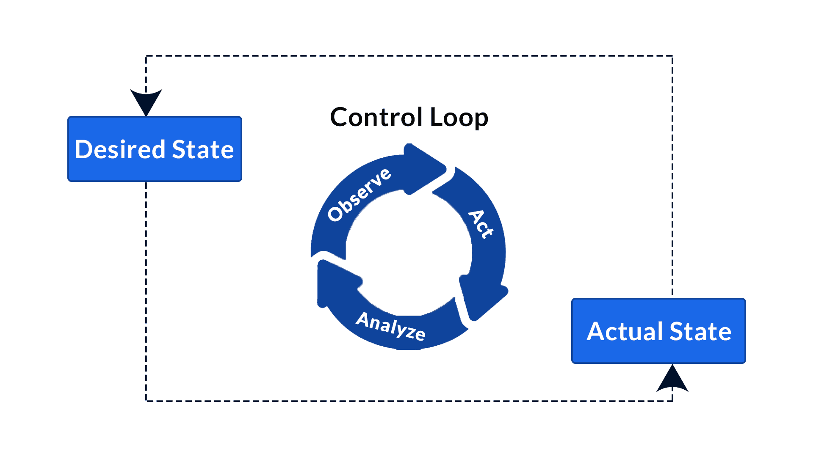

# Kubernetes Operator

Kubernetes Operator is an extension to Kubernetes API Server that make great flixibility to manage software components and monitor them in runtime

So instead of dealing with the standard `Resource Difinition` of Kubernetes, We can build our own like below:

```yaml
# Standard one
apiVersion: apps/v1
kind: Deployment
metadata:
  name: nginx
  [...]

# Kubernetes Operator
apiVersion: example.com/v1
kind: AwesomeResource # it can be anything according to our implementation and use case
metadata:
  name: awesome-resource
  [...]
```

And like we use in Kubectl command as below:

```bash
kubectl get Deployment
kubectl get AwesomeResource
```

We can find a lot of open sourced operator in [Operator Hub](https://operatorhub.io/)

## How it works ?

It is simply a `Controller` which watches and listens for specific events of our implemented resource in Kubernetes API and takes specific action according to the event

So it seems as a `Control Loop` [ Observe/Watch => Analyz/Check => Act ]



## Writing our own Operator:

Just we need to Scaffold the code structre and basic code using one of the below two methods:
  - [Operator-SDK](https://github.com/operator-framework/operator-sdk)
  - [Kubebuilder](https://github.com/kubernetes-sigs/kubebuilder)

## Operator Components:

### Custom Resource Definition (CRD)
It defines a new resource type in Kubernetes. It specifies the structure and behavior of the custom resource that the Operator manages. Operators leverage CRDs to extend the Kubernetes API.

### Controller
Is responsible for reconciling the desired state of the custom resources with their actual state in the cluster. It watches for changes in the custom resources and performs actions to bring them into the desired state.

### Reconciliation Loop
Is the core logic of the Controller. It continuously monitors the cluster in runtime for changes to the custom resources and takes actions to ensure their desired state is maintained.

### Custom Resource (CR)
Custom Resource Instances are the actual instances of the custom resources managed by the Operator. They are created and modified by users through the Kubernetes API.


